# Execution Plan — 테이블오더 서비스

## Detailed Analysis Summary

### Change Impact Assessment
- **User-facing changes**: Yes — 고객용 주문 UI, 관리자용 대시보드 UI 신규 구축
- **Structural changes**: Yes — 전체 시스템 아키텍처 신규 설계 (Spring Boot + React x2 + MySQL + S3)
- **Data model changes**: Yes — 11개 엔티티 신규 설계
- **API changes**: Yes — REST API 전체 신규 설계
- **NFR impact**: Yes — SSE 실시간 통신, JWT 인증, 보안 규칙 15개 적용, 백업 정책

### Risk Assessment
- **Risk Level**: Medium
- **Rollback Complexity**: Easy (Greenfield — 기존 시스템 없음)
- **Testing Complexity**: Moderate (SSE 실시간 통신, 멀티테넌트, 세션 관리)

---

## Workflow Visualization

```mermaid
flowchart TD
    Start(["User Request"])

    subgraph INCEPTION["INCEPTION PHASE"]
        WD["Workspace Detection<br/>COMPLETED"]
        RA["Requirements Analysis<br/>COMPLETED"]
        US["User Stories<br/>COMPLETED"]
        WP["Workflow Planning<br/>COMPLETED"]
        AD["Application Design<br/>EXECUTE"]
        UG["Units Generation<br/>EXECUTE"]
    end

    subgraph CONSTRUCTION["CONSTRUCTION PHASE"]
        FD["Functional Design<br/>EXECUTE"]
        NFRA["NFR Requirements<br/>EXECUTE"]
        NFRD["NFR Design<br/>EXECUTE"]
        ID["Infrastructure Design<br/>EXECUTE"]
        CG["Code Generation<br/>EXECUTE"]
        BT["Build and Test<br/>EXECUTE"]
    end

    Start --> WD
    WD --> RA
    RA --> US
    US --> WP
    WP --> AD
    AD --> UG
    UG --> FD
    FD --> NFRA
    NFRA --> NFRD
    NFRD --> ID
    ID --> CG
    CG --> BT
    BT --> End(["Complete"])

    style WD fill:#4CAF50,stroke:#1B5E20,stroke-width:3px,color:#fff
    style RA fill:#4CAF50,stroke:#1B5E20,stroke-width:3px,color:#fff
    style US fill:#4CAF50,stroke:#1B5E20,stroke-width:3px,color:#fff
    style WP fill:#4CAF50,stroke:#1B5E20,stroke-width:3px,color:#fff
    style AD fill:#FFA726,stroke:#E65100,stroke-width:3px,stroke-dasharray: 5 5,color:#000
    style UG fill:#FFA726,stroke:#E65100,stroke-width:3px,stroke-dasharray: 5 5,color:#000
    style FD fill:#FFA726,stroke:#E65100,stroke-width:3px,stroke-dasharray: 5 5,color:#000
    style NFRA fill:#FFA726,stroke:#E65100,stroke-width:3px,stroke-dasharray: 5 5,color:#000
    style NFRD fill:#FFA726,stroke:#E65100,stroke-width:3px,stroke-dasharray: 5 5,color:#000
    style ID fill:#FFA726,stroke:#E65100,stroke-width:3px,stroke-dasharray: 5 5,color:#000
    style CG fill:#4CAF50,stroke:#1B5E20,stroke-width:3px,color:#fff
    style BT fill:#4CAF50,stroke:#1B5E20,stroke-width:3px,color:#fff
    style INCEPTION fill:#BBDEFB,stroke:#1565C0,stroke-width:3px,color:#000
    style CONSTRUCTION fill:#C8E6C9,stroke:#2E7D32,stroke-width:3px,color:#000
    style Start fill:#CE93D8,stroke:#6A1B9A,stroke-width:3px,color:#000
    style End fill:#CE93D8,stroke:#6A1B9A,stroke-width:3px,color:#000
    linkStyle default stroke:#333,stroke-width:2px
```



### Text Alternative
```
Phase 1: INCEPTION
  - Workspace Detection (COMPLETED)
  - Requirements Analysis (COMPLETED)
  - User Stories (COMPLETED)
  - Workflow Planning (COMPLETED)
  - Application Design (EXECUTE)
  - Units Generation (EXECUTE)

Phase 2: CONSTRUCTION
  - Functional Design (EXECUTE, per-unit)
  - NFR Requirements (EXECUTE, per-unit)
  - NFR Design (EXECUTE, per-unit)
  - Infrastructure Design (EXECUTE, per-unit)
  - Code Generation (EXECUTE, per-unit)
  - Build and Test (EXECUTE)
```

---

## Phases to Execute

### INCEPTION PHASE
- [x] Workspace Detection (COMPLETED)
- [x] Requirements Analysis (COMPLETED)
- [x] User Stories (COMPLETED)
- [x] Workflow Planning (COMPLETED)
- [ ] Application Design - EXECUTE
  - **Rationale**: 신규 프로젝트로 컴포넌트 식별, 서비스 레이어 설계, 컴포넌트 간 의존성 정의 필요
- [ ] Units Generation - EXECUTE
  - **Rationale**: 3개 주요 시스템(customer-web, admin-web, api-server)과 인프라로 분해하여 병렬 개발 가능한 단위 정의 필요

### CONSTRUCTION PHASE (per-unit)
- [ ] Functional Design - EXECUTE
  - **Rationale**: 11개 엔티티, 복잡한 비즈니스 로직(세션 관리, 주문 상태 전이, 분할 계산) 상세 설계 필요
- [ ] NFR Requirements - EXECUTE
  - **Rationale**: SSE 실시간 통신, JWT 인증, 보안 규칙 15개, 백업 정책, 중규모 확장성 요구사항 존재
- [ ] NFR Design - EXECUTE
  - **Rationale**: NFR Requirements에서 도출된 패턴을 구체적 설계에 반영 필요
- [ ] Infrastructure Design - EXECUTE
  - **Rationale**: AWS 배포 환경, S3 이미지 스토리지, MySQL, 백업 정책 등 인프라 설계 필요
- [ ] Code Generation - EXECUTE (ALWAYS)
  - **Rationale**: 구현 필수
- [ ] Build and Test - EXECUTE (ALWAYS)
  - **Rationale**: 빌드 및 테스트 지침 필수

### OPERATIONS PHASE
- [ ] Operations - PLACEHOLDER

---

## Skipped Stages
- Reverse Engineering — Greenfield 프로젝트이므로 해당 없음

---

## Success Criteria
- **Primary Goal**: 중규모(10~50개 매장) 테이블오더 플랫폼 MVP 구축
- **Key Deliverables**: Spring Boot API 서버, React 고객용 앱, React 관리자용 앱, MySQL 스키마, AWS 인프라 설계
- **Quality Gates**: SECURITY-01~15 전체 준수, INVEST 기준 충족, Given/When/Then 수용 기준 통과
